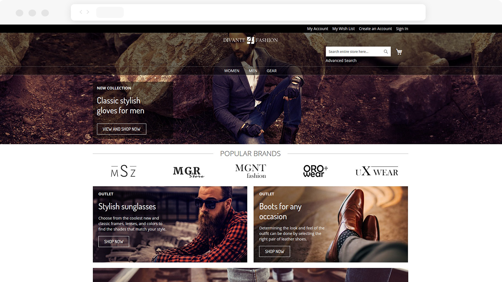
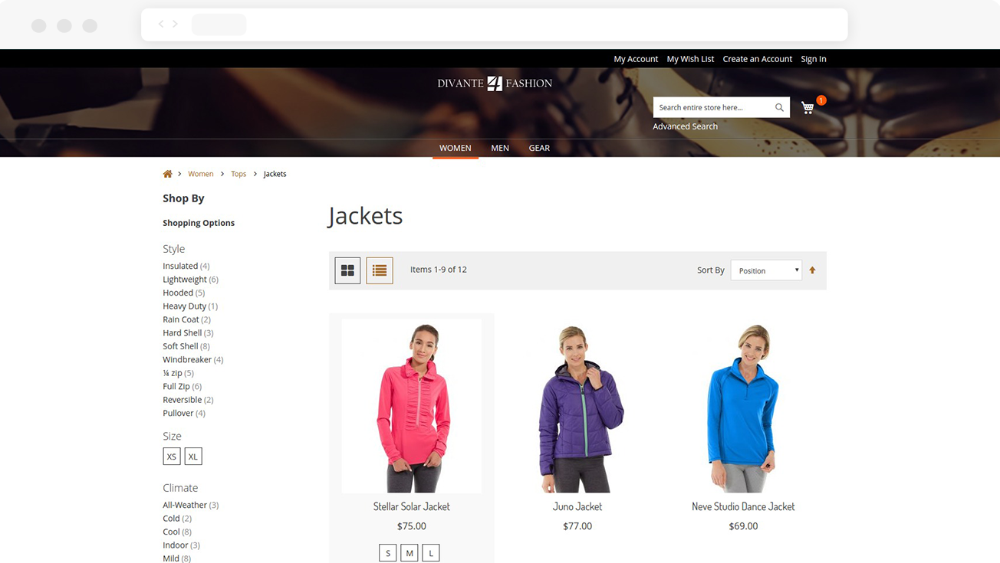
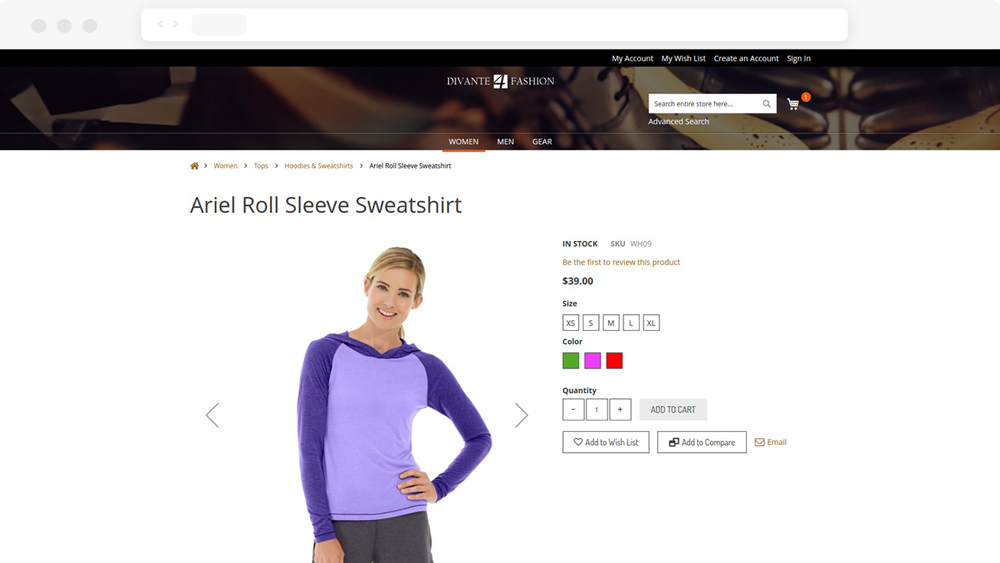
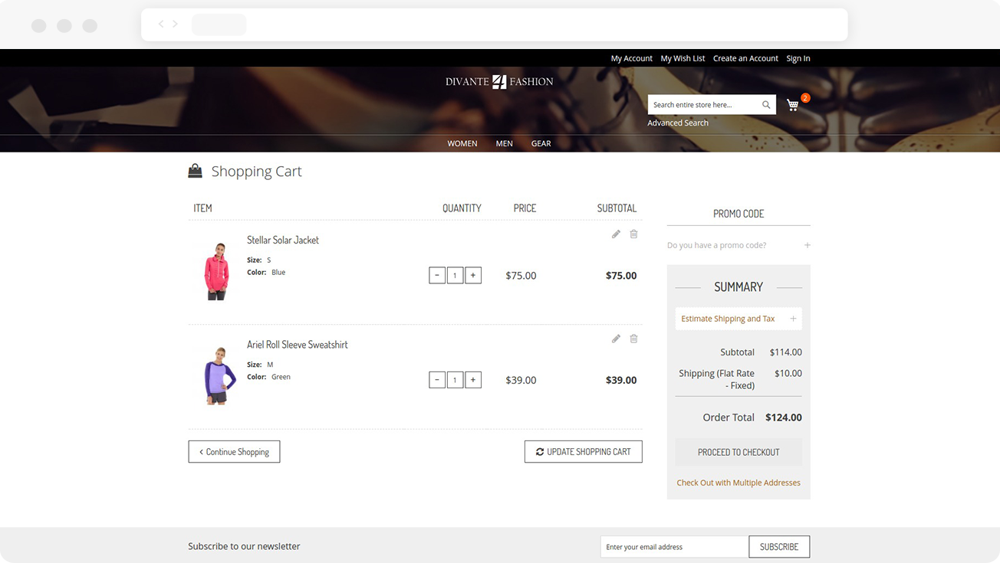
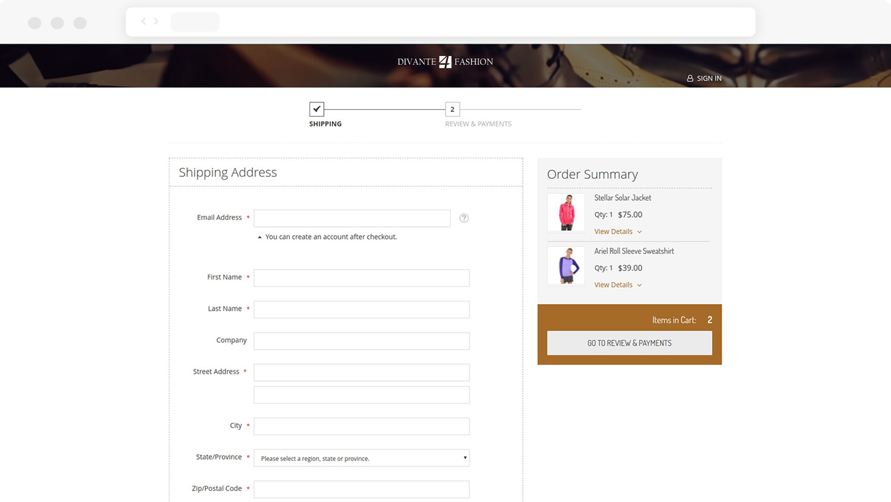

# Magento 2 Theme Frontend Rapid

Free, fully responsive Magento 2 theme created for the Fashion industry - but not only.
This theme is an extension of the default theme for Magento 2 "theme-frontend-blank".
It was written to streamline the development process by adjusting the most frequently modified parts of the site to this industry.

## Compatibility
* This module was written based on Magento 2.1.9 

## Extensibility
This module possesses specially prepared “less” files - “_extend-specific.less”, which allow the module to be extended.
If the theme “theme-frontend-rapid” is used, the inheritance of themes is as follows:

**theme-frontend-blank < theme-frontend-rapid < specific-theme**  

An example of the less file structure for a particular project based on "Divante / specific" using the theme “frontend-rapid” is as follows:

app/design/frontend/Divante/specific - Package/Theme  
app/design/frontend/Divante/specific/Magento_Theme - Specific module as an example  
app/design/frontend/Divante/specific/Magento_Theme/web/css/source/_extend-specific.less - File to extend  
 
## Additional information
The Frontend Rapid theme provided comes with the module "module-uikit", which contains the most often customized parts of the site. It was designed to provide better control over the code and consistency of the appearance of global elements. 
Its composition includes, among others:  
* Buttons
* Form elements
* Typography
* Magento messages
* Pagination  

Uikit is available at: baseUrl / uikit  
example: http://rapid.divante.co/uikit

## Setup

#### Installation details

* `composer require divante/theme-frontend-rapid`
* `php bin/magento setup:upgrade`

#### Admin configuration

* Go to admin panel under “Content > (Design) Configuration”
* Choose store and click “Edit” link in action column
* Under “Default Theme” tab set option “Divante Rapid” for “Applied Theme”
    
#### Features on front

 
 
 
 
 
 
## Live Demo

http://rapid.divante.co/
    
## License
* The Grouped Products Manager module is licensed under the terms of the MIT license.
    
## Standards & Code Quality
* This module respects all Magento2 code quality rules and our own PHPCS and PHPMD rulesets.

## Why use Magento 2 Theme Frontend Rapid
46% increase in revenue - this is how much you can achieve with an online shop. That’s why it’s the high time for you to start thinking seriously about your online store. Working with many Fashion eStores we learned from the habits of fashion eShops users. It helps us to create a product adjusted to their needs. See our [case studies](https://divante.co/case-studies/ "case studies"). 

## About Authors

    

We are a Software House from Europe, existing from 2008 and employing about 150 people. Our core competencies are built around Magento, Pimcore and bespoke software projects (we love Symfony3, Node.js, Angular, React, Vue.js). We specialize in sophisticated integration projects trying to connect hardcore IT with good product design and UX.

We work for Clients like INTERSPORT, ING, Odlo, Onderdelenwinkel or CDP, the company that produced The Witcher game. We develop two projects: [Open Loyalty](http://www.openloyalty.io/ "Open Loyalty") - loyalty program in open source and [Vue.js Storefront](https://github.com/DivanteLtd/vue-storefront "Vue.js Storefront").

We are part of the OEX Group which is listed on the Warsaw Stock Exchange. Our annual revenue has been growing at a minimum of about 30% year on year.

Visit our website [Divante.co](https://divante.co/ "Divante.co") for more information.