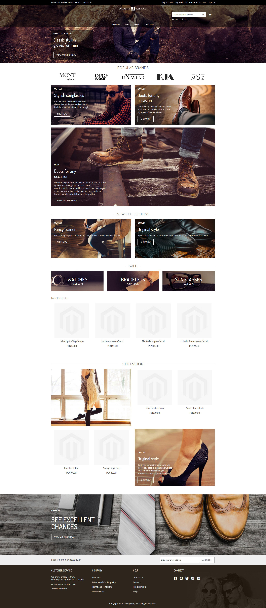

# Magento 2 Theme Frontend Rapid

Free, fully responsive Magento 2 theme created for the Fashion industry - but not only.
This theme is an extension of the default theme for Magento 2 "theme-frontend-blank".
It was written to streamline the development process by adjusting the most frequently modified parts of the site to this industry.

## Who is developing Theme Frontend Rapid ?

    

Divante has been delivering the highest quality e-commerce solutions since its inception in 2008. Our main focus is to create the most elegant and effective e-commerce services. We connect the latest technology with a great business approach.
Visit our website for more information  <a href="https://divante.co/">Divante.co</a> 

## Compatibility
* This module was written based on Magento 2.1.9 

## Extensibility
This module possesses specially prepared “less” files - “_extend-specific.less”, which allow the module to be extended.
If the theme “theme-frontend-rapid” is used, the inheritance of themes is as follows:

**theme-frontend-blank < theme-frontend-rapid < specific-theme**  

An example of the less file structure for a particular project based on "Divante / specific" using the theme “frontend-rapid” is as follows:

app/design/frontend/Divante/specific - Package/Theme  
app/design/frontend/Divante/specific/Magento_Theme - Specific module as an example  
app/design/frontend/Divante/specific/Magento_Theme/web/css/source/_extend-specific.less - File to extend  
 
## Additional information
The Frontend Rapid theme provided comes with the module "module-uikit", which contains the most often customized parts of the site. It was designed to provide better control over the code and consistency of the appearance of global elements. 
Its composition includes, among others:  
* Buttons
* Form elements
* Typography
* Magento messages
* Pagination  

Uikit is available at: baseUrl / uikit  
example: http://magento.dev/uikit

## Setup

#### Installation details

* `composer require divante/theme-frontend-rapid`
* `php bin/magento setup:upgrade`

#### Admin configuration

* Go to admin panel under “Content > (Design) Configuration”
* Choose store and click “Edit” link in action column
* Under “Default Theme” tab set option “Divante Rapid” for “Applied Theme”
    
#### Features on front

 
 
## Live Demo

http://rapid.test.divante.pl/
    
## License
* The Grouped Products Manager module is licensed under the terms of the MIT license.
    
## Standards & Code Quality
* This module respects all Magento2 code quality rules and our own PHPCS and PHPMD rulesets.
